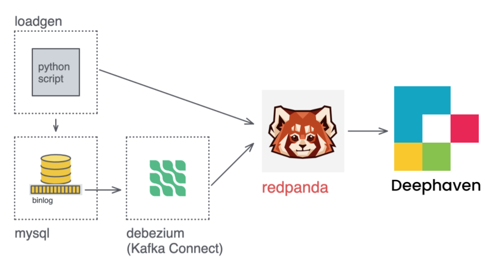
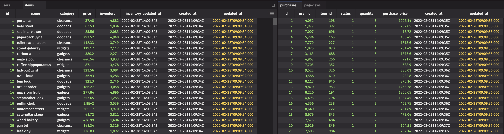

# deephaven-debezium-demo

The demo follows closely the one defined for [Materialize](https://github.com/MaterializeInc/ecommerce-demo/blob/main/README_RPM.md). We want to showcase how you can accomplish the same workflow in Deephaven, with lightning-fast performance.

The docker-compose file in this directory starts a compose with images for MySQL, [Redpanda](https://redpanda.com/), [Debezium](https://debezium.io/), and Deephaven, plus an additional image to generate an initial MySQL schema and then generate updates to the tables over time for a simple e-commerce demo.




### Components

* `docker-compose.yml` - The Docker Compose file for the application. This is mostly the same as the [Deephaven docker-compose file](https://raw.githubusercontent.com/deephaven/deephaven-core/main/containers/python/docker-compose.yml) with modifications to run Redpanda, MySQL, Debezium, and the scripts to generate the simulated website.
* `.env` - The environmental variables used in this demo.
* `scripts/demo.py` - The Deephaven commands used in this demo.
* `scripts/demo.sql` - The Materialize demo script.
* `loadgen/*` - The load generation scripts.

Configure the update rate for both purchase (MySQL updates) and pageviews (Kafka pageview events) via ENVIRONMENT arguments set for the loadgen image in the docker-compose.yml file.

## Quick Start

First, to run this demo you will need to clone our [github examples repo](https://github.com/deephaven-examples/deephaven-debezium-demo):

```
gh repo clone deephaven-examples/deephaven-debezium-demo
```

To build, you need to have the standard Deephaven dependancies such as docker and docker-compose.

For more detailed instructions, see our [Quickstart guide](https://deephaven.io/core/docs/tutorials/quickstart/).

1. Launch via Docker:

```
cd deephaven-debezium-demo
docker-compose up -d
```

2. Then start a [Deephaven web console](http://localhost:10000/ide) (this will be in Python mode by default, per the command above) by navigating to:

```
http://localhost:10000/ide
```

3. Copy and paste to it from `/scripts/demo.py`.  

As you copy and paste the script, you can see tables as they are created and populated and watch them update before you execute the next command.  Details below.


## Details to implement

The numbered steps below are from the demo defined for the [Redpanda + Materialize Demo](https://github.com/MaterializeInc/ecommerce-demo/blob/main/README_RPM.md).

4. _Optional_ Confirm that everything is running as expected:

```shell session
docker stats
```

5. _Optional_ Log in to MySQL to confirm that tables are created and seeded:

```shell
docker-compose run mysql mysql -uroot -pdebezium -h mysql shop
```

```sql
SHOW TABLES;

SELECT * FROM purchases LIMIT 1;
```

6. _Optional_ `exec` in to the `redpanda` container to look around using Redpanda's amazing `rpk` CLI:

```shell session
docker-compose exec redpanda /bin/bash

rpk debug info

rpk topic list

rpk topic create dd_flagged_profiles

rpk topic consume pageviews
```

You should see a live feed of JSON formatted pageview Kafka messages:

```
{
    "key": "3290",
    "message": "{\"user_id\": 3290, \"url\": \"/products/257\", \"channel\": \"social\", \"received_at\": 1634651213}",
    "partition": 0,
    "offset": 21529,
    "size": 89,
    "timestamp": "2021-10-19T13:46:53.15Z"
}
```


### Deephaven Commands

You have now launched a docker-compose file that starts images for MySQL, Debezium, Redpanda (Kafka implementation), and Deephaven, plus an additional image to generate an initial MySQL schema and then generate updates to the tables over time for a simple e-commerce demo.

Here, we will show you the analogous Deephaven commands and continue the bullet numbers from the [Materialize Demo](https://github.com/MaterializeInc/ecommerce-demo/blob/main/README_RPM.md). You can follow along in the [Deephaven IDE](http://localhost:10000/ide) by entering the commands into theconsole.

7. Now that you're in the Deephaven IDE, define all of the tables in `mysql.shop` as Kafka sources:

```python skip-test
import deephaven.stream.kafka.cdc as cc
from deephaven import kafka_consumer as ck
from deephaven import kafka_producer as pk
from deephaven.stream.kafka.consumer import TableType, KeyValueSpec
from deephaven import dtypes as dh
from deephaven import agg as agg
from deephaven.experimental import time_window

server_name = 'mysql'
db_name='shop'

kafka_base_properties = {
    'group.id' : 'dh-server',
    'bootstrap.servers' : 'redpanda:9092',
    'schema.registry.url' : 'http://redpanda:8081',
}


def make_cdc_table(table_name:str):
    return cc.consume(
        kafka_base_properties,
        cc.cdc_short_spec(server_name,
                          db_name,
                          table_name)
    )

users = make_cdc_table('users')
items = make_cdc_table('items')
purchases = make_cdc_table('purchases')

consume_properties = {
    **kafka_base_properties,
    **{
        'deephaven.partition.column.name' : '',
        'deephaven.timestamp.column.name' : '',
        'deephaven.offset.column.name' : ''
    }
}

pageviews = ck.consume(
    consume_properties,
    topic = 'pageviews',
    offsets = ck.ALL_PARTITIONS_SEEK_TO_BEGINNING,
    key_spec = KeyValueSpec.IGNORE,
    value_spec = ck.json_spec([ ('user_id', dh.int_),
                      ('url', dh.string),
                      ('channel', dh.string),
                      ('received_at', dh.DateTime) ]),
    table_type = TableType.Append
)
```

Because the first three sources are pulling message schema data from the registry, Deephaven knows the column types to use for each attribute. The last source is a JSON-formatted source for the page views.

Now you should _automatically_ see the four sources we created in the IDE. These are fully interactable. In the UI, you can [sort](/core/docs/how-to-guides/user-interface/work-with-columns/), [filter](/core/docs/how-to-guides/user-interface/filters/) or scroll through _all_ the data without any other commands.



8. Next, we'll create a table for staging the page views. We can use this to aggregate information later.

```python skip-test
pageviews_stg = pageviews \
    .update_view([
        'url_path = url.split(`/`)',
        'pageview_type = url_path[1]',
        'target_id = Long.parseLong(url_path[2])'
    ]).drop_columns('url_path')
```

### Analytical views

9. Let's create a couple analytical views to get a feel for how it works.

Start simple with a table that aggregates purchase stats by item:

```python skip-test
purchases_by_item = purchases.agg_by(
    [
        agg.sum_(['revenue = purchase_price']),
        agg.count_('orders'),
        agg.sum_(['items_sold = quantity'])
    ],
    'item_id'
)
```

The next query creates something similar that uses our `pageview_stg` static view to quickly aggregate page views by item:

```python skip-test
pageviews_by_item = pageviews_stg \
    .where(['pageview_type = `products`']) \
    .count_by('pageviews', ['item_id = target_id'])
```

Now let's show how you can combine and stack views by creating a single table that brings everything together:

```python skip-test
item_summary = items \
    .view(['item_id = id', 'name', 'category']) \
    .natural_join(purchases_by_item, on = ['item_id']) \
    .natural_join(pageviews_by_item, on = ['item_id']) \
    .drop_columns('item_id') \
    .move_columns_down(['revenue', 'pageviews']) \
    .update_view(['conversion_rate = orders / (double) pageviews'])
```

We can _automatically_ see that it's working by watching these tables update in the IDE. To see just the top elements, we can filter the data with two new tables:

```python skip-test
# These two 'top_*' tables match the 'Business Intelligence: Metabase' / dashboard
# part of the original example.
top_viewed_items = item_summary \
        .sort_descending('pageviews') \
        .head(20)

top_converting_items = item_summary \
    .sort_descending('conversion_rate') \
    .head(20)
```


Another useful table is `pageviews_summary` that counts the total number of pages seen:

```python skip-test
pageviews_summary = pageviews_stg \
    .agg_by(
        [
            agg.count_('total'),
            agg.max_(['max_received_at = received_at'])
        ]) \
    .update(['dt_ms = (DateTime.now() - max_received_at)/1_000_000.0'])
```

### User-facing data views

10.  [Redpanda](https://redpanda.com/) is often used in building rich data-intensive applications. Let's try creating a view meant to power something like the "Who has viewed your profile" feature on Linkedin:

User views of other user profiles:

```python skip-test
minute_in_nanos = 60 * 1000 * 1000 * 1000

profile_views_per_minute_last_10 = \
    time_window(
        pageviews_stg.where(['pageview_type = `profiles`']),
        ts_col='received_at',
        window=10*minute_in_nanos,
        bool_col='in_last_10min'
    ).where(
        ['in_last_10min = true']
    ).update_view(
        ['received_at_minute = lowerBin(received_at, minute_in_nanos)']
    ).view(
        ['user_id = target_id',
        'received_at_minute']
    ).count_by(
        'pageviews',
        ['user_id',
        'received_at_minute']
    ).sort(
        ['user_id',
        'received_at_minute']
    )

```

Confirm that this is the data we could use to populate a "profile views" graph for user `10`:

```python skip-test 
profile_views = pageviews_stg \
    .view([
        'owner_id = target_id',
        'viewer_id = user_id',
        'received_at'
    ]).sort([
        'received_at'
    ]).tail_by(10, 'owner_id')
```

Next, let's use a `naturalJoin` to get the last five users who have viewed each profile:

```python skip-test
profile_views_enriched = profile_views \
    .natural_join(users, on = ['owner_id = id'], joins = ['owner_email = email']) \
    .natural_join(users, on = ['viewer_id = id'], joins = ['viewer_email = email']) \
    .move_columns_down('received_at')
```

### Demand-driven query

11. Since Redpanda has such a nice HTTP interface, it makes it easier to extend without writing lots of glue code and services. Here's an example where we use pandaproxy to do a "demand-driven query".

Add a message to the `dd_flagged_profiles` topic:

```python skip-test
dd_flagged_profiles = ck.consume(
    consume_properties,
    topic = 'dd_flagged_profiles',
    offsets = ck.ALL_PARTITIONS_SEEK_TO_BEGINNING,
    key_spec = KeyValueSpec.IGNORE,
    value_spec = ck.simple_spec('user_id_str', dh.string),
    table_type = TableType.Append
).view(['user_id = Long.parseLong(user_id_str.substring(1, user_id_str.length() - 1))'])  # strip quotes
```

Now let's join the `flagged_profile` id to a much larger dataset:

```python skip-test
dd_flagged_profile_view = dd_flagged_profiles \
    .join(pageviews_stg, 'user_id')
```

12. Sink data back out to Redpanda.

Let's create a view that flags "high-value" users that have spent $10k or more total:

```python skip-test
high_value_users = purchases \
    .update_view([
        'purchase_total = purchase_price * quantity'
    ]).agg_by([
            agg.sum_(['lifetime_value = purchase_total']),
            agg.count_('purchases')
        ],
        'user_id'
    )\
    .where(['lifetime_value > 10000']) \
    .natural_join(users, 
                  ['user_id = id'], ['email']) \
    .view(['id = user_id', 'email', 'lifetime_value', 'purchases'])  # column rename and reorder
```

Then, a sink to stream updates to this view back out to Redpanda:

```python skip-test
schema_namespace = 'io.deephaven.examples'

cancel_callback = pk.produce(
    high_value_users,
    kafka_base_properties,
    topic = 'high_value_users_sink',
    key_spec = pk.avro_spec(
        'high_value_users_sink_key',
        publish_schema = True,
        schema_namespace = schema_namespace,
        include_only_columns = [ 'user_id' ]
    ),
    value_spec = pk.avro_spec(
        'high_value_users_sink_value',
        publish_schema = True,
        schema_namespace = schema_namespace,
        column_properties = {
            "lifetime_value.precision" : "12",
            "lifetime_value.scale" : "4"
        }
    ),
    last_by_key_columns = True
)
```


We won't be able to preview the results with `rpk` because it's AVRO formatted. But we can actually stream it BACK into Deephaven to confirm the format!

```python skip-test
hvu_test = ck.consume(
    consume_properties,
    topic = 'high_value_users_sink',
    offsets = ck.ALL_PARTITIONS_SEEK_TO_BEGINNING,
    key_spec = KeyValueSpec.IGNORE,
    value_spec = ck.avro_spec('high_value_users_sink_value'),
    table_type = TableType.Append
)
```

## Conclusion

You now have Deephaven doing real-time views on a changefeed from a database and page view events from Redpanda. You have complex multi-layer views doing joins and aggregations in order to distill the raw data into a form that's useful for downstream applications.

You have a lot of infrastructure running in Docker containers - don't forget to run `docker-compose down` to shut everything down!

Next time, if you want to load everything in one command, you can load that in its entirety on the DH console with `exec(open('/scripts/demo.py').read())`


## Taking it further

You've how fun and easy it is to use Deephaven. Within the IDE, you can see your query results and interact with all the data. You can take this even further with Deephaven's plotting capabailities, such as by visualizing the aggregrate page views in real time.


# Attributions

Files in this directory are based on demo code by Debezium, Redpanda, and Materialize:

* [Debezium](https://github.com/debezium/debezium)
* [Redpanda](https://github.com/vectorizedio/redpanda)
* [Materialize](https://github.com/MaterializeInc/materialize)
* [Materialize e-commerce demo](https://github.com/MaterializeInc/ecommerce-demo/blob/main/README_RPM.md)

## Note

The code in this repository is built for Deephaven Community Core v0.11.0. No guarantee of forward or backward compatibility is given.
